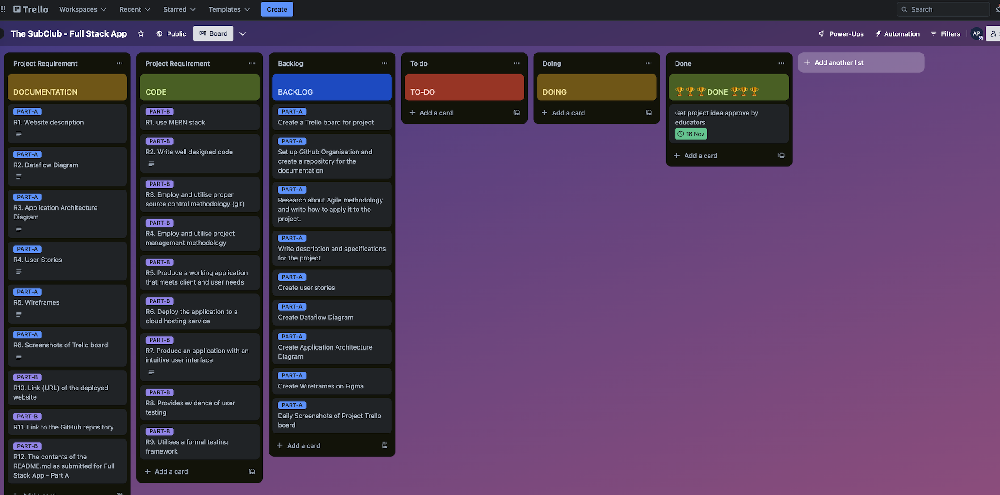

# Project Activity Log

Welcome to the activity log of my SubClub fullstack web app project. This document serves as a daily record of progress, providing a clear overview of each day's tasks and achievements.

In this log you will find the date, the daily objectives and a summary of what has been achieved. For clarity, a screenshot of the Trello board is included at the end of each day, providing a visual summary of the project status.

This activity log is not only a tool for personal accountability, but also a valuable resource for self-assessment and future planning.

### Day 0

#### Date: Thu 16 Nov 2023

We start our solo full stack Project!

It has been a busy but productive day and this is what I have achieved today:

* I found a problem I was passionate about and devised a solution for it using technology.
* I posted the idea on the discord channel and got the project approved by the educators.
* I created the project's Trello board, wrote down the requirements and the tasks planned to meet the rubrics.

**Trello board**

