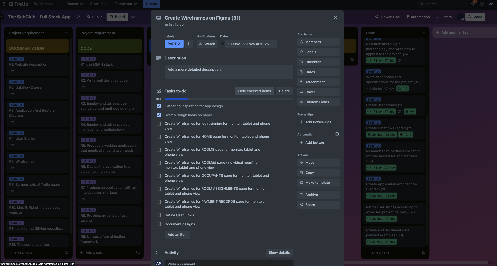

# Project Activity Log

Welcome to the activity log of my Sub.Club fullstack web app project. This document serves as a daily record of progress, providing a clear overview of each day's tasks and achievements.

In this log you will find the date, the daily goals and a summary of what has been achieved. For clarity, a screenshot of the Trello board is included at the end of each day, providing a visual summary of the project status.

This activity log is not only a tool for personal accountability, but also a valuable resource for self-assessment and future planning.

## Day 1
* Create a very detailed plan of the task I need to develop to build this project.
* Create the corresponding repository for the backend on gitHub.
* Create the corresponding repository for the frontend on github.
* Read about how to design and document the endpoints of the project. Create what is known as the API Contract.
#### Date: Thu 16 Nov 2023

We start our solo full stack Project!

It has been a busy but productive day and this is what I have achieved today:

* I found a problem I was passionate about and devised a solution for it using technology.
* I posted the idea on the discord channel and got the project approved by the educators.
* I created the project's Trello board, wrote down the requirements and the tasks planned to meet the rubrics.
* I have created a GitHub organisation and a dedicated repository for the project documentation.
* I have created another mardown file to keep track of the project activity log (this one).

**Initial Trello board**

**End of the day Trello board**

## Day 2

#### Date: Fri 17 Nov 2023

**Goals:**

* Write project description with the specification of the project including: purpose, functionality/features, target audience, and the tech stack (25 Trello card).
* Research about Agile methodology and write how to apply it to the project (34 Trello card).
* Research third parties services for that need it for app features (35 Trello card).
* Create at least 3 user stories (persona) for each target audience.

**Achievements and reflexion of the day:**

So far I have completed most of the tasks of the day. I started with researching the third party services and packages that I need for the development of the application, however, I hit a roadblock as I needed to know more about the users' needs.  I spent the afternoon talking to friends who had sublet before and asked them about their experiences and struggles. Having this information I started the creation of the user stories and put on hold the third party services for the application.

**End of the day Trello board**

## Day 3

#### Date: Sat 18 Nov 2023

**Goals:**

* Finish the user stories
* Create the user persona cards

**Achievements and reflexion of the day:**

I've only worked a couple of hours on the project today, I've written some of the user stories and started working on the user cards.
For the cards I have decided to do them on canvas, so they are still a work in progress.

**End of the day Trello board**

## Day 4

#### Date: Sun 19 Nov 2023

**Goals:**

* Finish user stories
* Finish user persona cards

**Achievements and reflexion of the day:**

My main goal was to finalise the user personas who represent the potential users of my app. However I realised that the more I created them(user persona cards) the more I was repeating myself, so I managed to compress potential users into 3 user personas and spent more time writing more user stories than I had initially.
I met my goal for today and additionally wrote a "business case" to give more context on who the target users are.

**Task added to card(28)**

**End of the day Trello board**

## Day 5

#### Date: Mon 20 Nov 2023

**Goals:**

* Divide the task of building a Data Flow Diagram (DFD) into 10 small stasks.
* Work on the first 5 tasks.

**Achievements and reflexion of the day:**

So far I have completed 6 of the 10 small tasks on card 29 (Create a data flow diagram) and this has helped me a lot to understand and establish more specific details about my web application. 

No change on the main board only on the card that I am working on.

**End of the day Trello board**

## Day 6

#### Date: Tue 21 Nov 2023

**Goals:**

* Create a Level 0 DFD and take that as a base to create a more detail DFD with all the process that the web application will handle.

* Build/document the detail DFD and add it to the project documentation.

**Achievements and reflexion of the day:**

I have worked out my DFD, it just needs a bit of refinement to officially put it in the documentation.

By breaking down the main activity into smaller tasks I was able to create a guideline, and as each task was very descriptive it was very easy to do them.

No change on the main board only on the card that I am working on.

**End of the day Trello board**

## Day 7

#### Date: Wen 22 Nov 2023

**Goals:**

* Review, refine and document DFD.
* Review and refine the description of the third parties services to used on the project.(35)
* Create a draft of the Application Architecture Diagram (30)
* Divide the activity of develop the wireframe (31) into small task.

**Achievements and reflexion of the day:**

Today was a productive day I have finally finished with my Data Flow Diagram and identified third party services to use in my project, so now I have to update some of the user stories and the tech stack description. 

This activity has helped me a lot to refine the scope of my project, unfortunately the time for the development of the application is short, so I will move some of the features I would like to implement as "Nice to have" and focus on the minimum viable product implementation.

**End of the day Trello board**

## Day 8

#### Date: Thu 23 Nov 2023

**Goals:**

* Create and document the Architecture Application Diagram (30)
* Review and refine the description of the third parties services and the user stories to adapt to the project scope.

**Achievements and reflexion of the day:**

I finally finished with the diagrams, I still need to work on the review and refine the description of the third parties services before starting with the wireframes.

**End of the day Trello board**

## Day 9

#### Date: Mon 27 Nov 2023

**Goals:**

* Refine the user stories according to the characteristics of the application.
* Add payload examples to help better understand the DFD.
* Gather inspiration for the design of the web application.

**Achievements and reflexion of the day:**

Today has been a very productive day, so far I have finished refining the diagrams and user stories. I have achieved my goals for today and have gone a step further by scratching the design of my web application on paper. Timing is crucial at this point, I want to spend enough time on my wireframes, and have time to make the necessary iterations and changes to deliver a good Minimum Viable Product.

In the screenshot of the trello board you can see the last card of my backload (not including the project development documentation) which is the creation of the wireframes on figma, this has been divided into small activities for better tracking of each activity that involves the development of the design of the application.

**End of the day Trello board**

## Day 10

#### Date: Tue 28 Nov 2023

**Goals:**

* Create the interface of the Login / Sign in feature of the app for small, medium and big devices.
* Create the HOME page view for small, medium and big devices. 

**Achievements and reflexion of the day:**

Today I reflected a lot on my original designs, and what I want to reflect with the look and feel of the application, although I didn't meet my goals for today, I feel it was a productive day because I started by choosing the colour palette, typography and logo.

I have added these activities that I didn't foresee initially on my todo list.

## Day 11

#### Date: Sat 02 Dec 2023

**Goals:**

Given the time, my goal today is to outline all the components and elements on each of the pages for the diffirent screen sizes, in order to obtain medium fidelity wireframes. So I can focus on colours and other small details tomorrow.

**Achievements and reflexion of the day:**

So far I have finished 4 of the 7 pages that I was expected to do.
However, I am relieved that I have found a way to create my wireframes:
1. First I write down the components I want the page to have.
2. I assign a section of the view where I want the component to be.
3. I add titles, buttons, and any other elements in their place.
4. I make sure the elements are equally spaced.
5. I add the colours, fonts and other things to make the page looks good.

## Day 12

#### Date: Sun 03 Dec 2023

**Goals:**

To finished this last part A of the project (Documentation) I have a few tasks to do:

1. Create the wireframes for monitor and phone views for the pages: Room Assignments and Payments 

2. Define user flows 

3. Finally document my designs on the project README

**Achievements and reflexion of the day:**

Yeeey! I finally finished the documentation of my project.
I have merged my Wireframe branch to the main branch with not problems.

Tomorrow I will start with the planning of the project start-up. I have left the card *"Daily Screenshots of Project Trello board and Project Activity Log (32) "* on the Trello board as I plan to continue documenting the development process of this project in this same document.

_________________________________________________________________

# PROJECT PART B 

## Day 13

#### Date: Mon 04 Dec 2023

**Goals:**

* Create a very detail plan of the task need it to develop to build this project.
* Create the corresponding repository for the backend on gitHub
* Create the corresponding repository for the frontend on github
* Read about how to design and document the project end-points. To create what is known as the API Contract.

**Achievements and reflexion of the day:**

So far I have created the repositories for the backend and frontend. I have also added 17 cards to my Trello board with detailed tasks, starting with the configuration of the backend part of the project and ending with the deployment of the whole project.

This whole project is very challenging given the limited time I have, which is why I plan to work on two or more Trello board cards per day to be able to finished on time.

**Initial Trello board**

## Day 14

#### Date: Wed 06 Dec 2023

**Goals:**

* Start with the backend configuration by creating a node project, install the necessary packages.

* Configure the database by connecting it to MongoDB Atlas, and create the schemas for our collections.

* Create routes for the collection of room.

* Create CRUD operations for the room.

* Work on fixing the PART-A documentation with feedback from educators.

* Start documenting endpoints and CRUD operations for the project in swager.

**Achievements and reflexion of the day:**

I have accomplished most of my goal of the day except the last 2 ones.

* Work on fixing the PART-A documentation with feedback from educators.

* Start documenting endpoints and CRUD operations for the project in swager.

Also I have forgot to include the test on Postman of the rooms endpoints. I will include that on my to  do list for tomorrow.

## Day 15

#### Date: Thu 07 Dec 2023

**Goals:**

* Create CRUD operations for users.
* Create routes for room controllers.
* Test user routes with Postman.
* Test room routes with Postman.
* Create Auht controller for LogIn feature

From yesterday:
* Work on fixing the PART-A documentation with feedback from educators.
* Start documenting endpoints and CRUD operations for the project in swager.

**Achievements and reflexion of the day:**

I have set up the authentication and authorisation part of the application, so that each user can create and view its content. I also started to work on correcting part A of the documentation, but that will require more than a single day, so I will bring those tasks as part of my activities for tomorrow.

## Day 16

#### Date: Sat 9 Dec 2023

**Goals:**

* Fix occupant schema.
* Create CRUD operations for occupants.
* Create routes for occupants controllers.
* Test occupants routes with Postman.
* Implement- unit test for the develop endpoints

From yesterday:
* Work on fixing the PART-A documentation with feedback from educators.
    * DFD 
    * Add Comments for wireframes for better understanding
* Start documenting endpoints and CRUD operations for the project in swager.

**Achievements and reflexion of the day:**
So far the occupant api is ready and has been tested manually in postman. I have started with the implementation of the unit tests, and the documentation of the endpoints.

## Day 17

#### Date: Mon 11 Dec 2023

**Goals:**

* Fix room assigment schema.
* Create CRUD operations for room assigment.
* Create routes for room assigment controllers.
* Test room assigment routes with Postman.
* Implement- unit test for the develop endpoints

On-going 
* Work on fixing the PART-A documentation with feedback from educators.
    * DFD 
    * Add Comments for wireframes for better understanding
* Continue documenting endpoints and CRUD operations for the project in swager.
