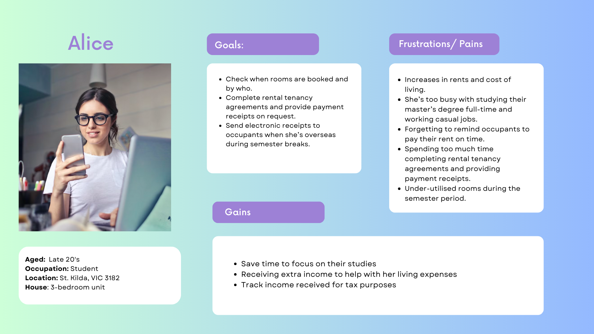
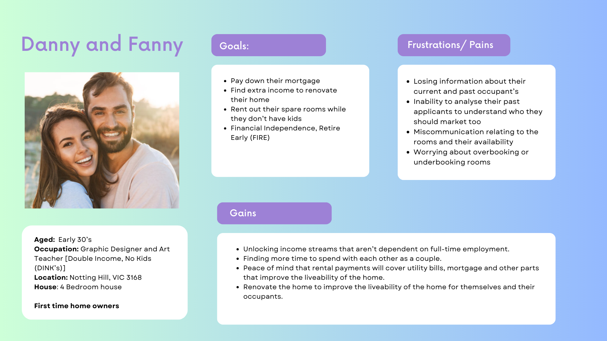
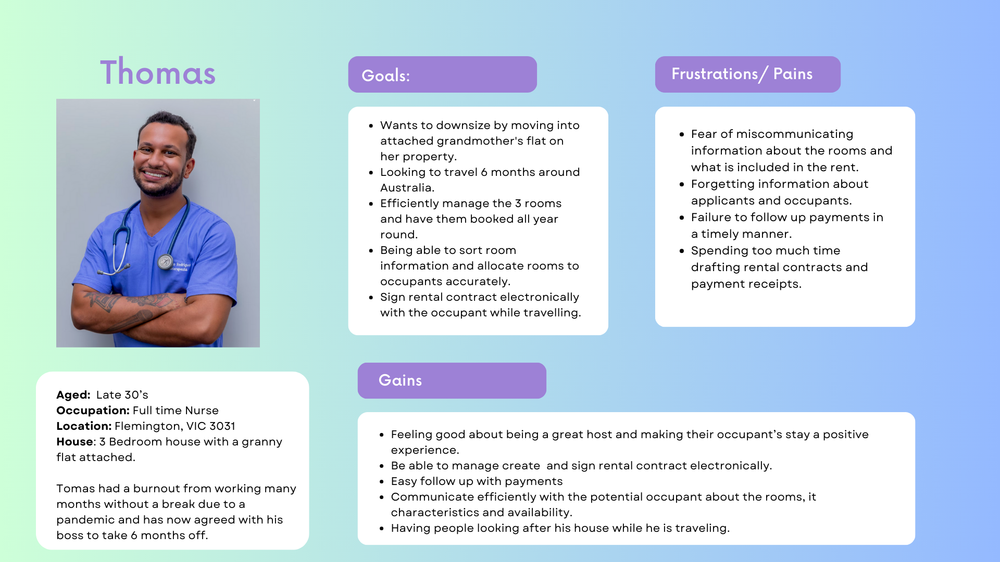

# Project: SubClub - The Sublet Management App

## Project Description:

### Overview

SubClub's inspiration comes from the housing challenges faced by individuals in Victoria, where the demand for affordable housing continues to grown. Witnessing the struggles of friends and acquaintances dealing with housing issues made me realise the need for rational solutions.

SubClub was born out of a desire to empower both potential subletters and those already involved in subletting. Based on personal experience and conversations with individuals grappling with the complexities of subletting, this web application aims to simplify the process of contract management and maintain transparent financial records.


### Problem Statement
The State of Victoria is experiencing a severe and continual rental crisis. This is marked by contributing factors that are making housing less affordable for renters.

Contributing factors may include:

The fall in supply due to lack of construction of new homes and dwellings
The lack of buildings repurposed for residential living
Increased taxes on investors, which has driven investors out from the residential market meaning more housing stock is being bought by owner occupiers. This in turn is negatively impacting the number of available rental properties on the market.
Increasing costs of energy impact the cost of living
Increased positive net migration driving up further demand in the rental market
Reduction to the total available medium to long term housing stock as homes have been repurposed for short-term stays (on a scale of days to weeks) for holiday and vacation rentals. E.g. AirBnB and Stayz
Increased cash rates from the Reserve Bank of Australia

As a result, more individuals are turning to shared living arrangements to cope with the housing demand. Many of these individuals (subletters and owner-occupiers with one or more unoccupied rooms or granny flats) are time poor and lack the experience needed to efficiently manage the subletting of their spare rooms to share the burden of higher rents or interest rates.


### Solution Statement
Sub.club is a web application that is used by Subletters to address the challenges of subletting. The application provides  a comprehensive solution for individuals looking to rent out their rooms for medium to long term (3 to 12 months).

This web application streamlines the process of managing agreements, recording payments and creating payment receipts.


## Key features:

With the sub.club web app, subletters are able to:

* Register new user account.
* Login and logout of user account.
* Create, update and view rooms (with the description of the room features and what is included in the rent).
* Create, update and view sub-tenant information.
* Create, update and view room assignments (subtenant(s), room and a date range).
    * When a room assignment is created, a printable lease agreement is automatically generated. This contract is based on the agreement of both parties and describes what is included in the rent, such as utilities, items accompanying the room (if furnished), cleaning services and access to shared common areas.
* Create (Registrated) and view past payments.
    * When a payment is created in the system, a payments receipt is auto-generated and is print friendly.


## Target Audience

The web application solution will operate within an environment that includes people and processes. These people will fall into two key main categories:

1. Listers
2. Occupants

**Listers** can be sub-categorised into:

1. **Home-owner who leases**
2. **Tenant who sublets**


The sub-categories of people (or actors within the system) are generalised under the umbrella term ‘Listers’ as they are listing their room on different platforms outside of the web application solution. Listers are the target end-users of the to be developed web application solution.

### Business case context

Outside of the web application solution, Listers advertise their spare rooms in one or more multiple ways, which may include:

* Facebook Marketplace
* Flatmates.com.au
* Gumtree.com.au
* Realestate.com.au
* Domain.com.au
* Word of mouth through friends and family

The above platforms only help to connect the lister and occupant. But, they do not assist Listers to manage the on-boarding, operational and off-boarding process such as managing contracts/agreements and payment reminders and receipts.

Existing solutions that Listers opt for currently include:

* *Paper-based solution* with printing, writing, scanning and filing to manage data
* *Excel-based solution* using Microsoft Excel or Google Sheets as a method to manage data
Or, a hybrid of both above solutions

The problems with the above options is that they are susceptible to human error due to lack of automatic user input validation as well as a lack of user-friendliness.

The web application solution aims to address the above identified market opportunity.


### User Personas

The Minimum Viable Product (MVP) to be developed will focus on delivering value to the Lister user persona. Value creation for the occupant user persona is considered out of scope for the MVP.

**Persona 1**



**Persona 2**



**Persona 3**




### User Stories

**User Story 1: PAYMENT DATE REMINDERS**

```
AS A Lister,
   I WANT to be reminded of payment dates
      SO THAT I can follow up receiving payments with my Tenants.
```

**User Story 2: TENANT PROFILE CREATION AND UPDATE**

```
AS A Lister,
    I WANT TO create and update tenant profiles
        SO THAT I can view the update information when I need them.
```


**User Story 3: CREATION OF ELECTRONIC PAYMENT RECEIPTS**
```
AS A Lister,
    I WANT to be able to create and send electronics payment receipts
        SO THAT I can have peace of mind when I am away from home.
```


**User Story 4: CREATION AND VIEW OF PAYMENT RECORD**

```
AS A Lister,
    I WANT to track the income I receive for the rent of my extra bedrooms
        SO THAT I can save time when doing my taxes.
```

**User Story 5: CREATE AND ASSIGN ROOMS**
```
AS A LISTER,
    I WANT to create customised room descriptions 
        SO THAT I can accurately assign tenants to them.
```

**User Story 6: VIEW CREATED ROOMS**

```
AS A lister,
    I WANT to view information of bedrooms and the dates that the are available and occupied
        SO THAT I can avoid overbooking rooms.
```

**User Story 7: AUTOMATIC PAYMENT RECEIPT GENERATION**
```
AS A lister,
    I WANT a payment receipt to be generated automatically
        SO THAT I can have more free time to spend on personal matters.
```

**User Story 8: SUBLET CONTRACT GENERATION**
```
AS A first time Lister,
    I WANT to be able to create subletting contracts 
        SO THAT I can clearly communicate what is included in the sublet agreement.
```


## Tech Stack

1. **Backend:**
   - **Node.js:** A JavaScript runtime that allows you to execute JavaScript code on the server side. It's designed to be lightweight and efficient for building scalable web applications.
   - **Express.js:** A web application framework for Node.js that simplifies the process of building robust and scalable APIs.

2. **Frontend:**
   - **JavaScript:** A versatile programming language that is widely used for building interactive and dynamic web applications.
   - **ReactJS (create-react-app):** A JavaScript library for building user interfaces, particularly for single-page applications. `create-react-app` is a tool that sets up a React project with a sensible default configuration.

3. **Database:**
   - **MongoDB Atlas:** A fully-managed cloud database service for MongoDB. It allows you to store and retrieve data in a flexible, JSON-like format.

4. **Deployment Server:**
   - **Heroku:** A cloud platform as a service (PaaS) that enables developers to deploy, manage, and scale applications. Heroku simplifies the deployment process and provides a platform for hosting web applications.

   - **Netlify:** A platform for continuous deployment that automates the process of deploying and hosting frontend applications. It also provides features like serverless functions and CDN for improved performance.

5. **CSS Framework:**
   - **Tailwind CSS:** A utility-first CSS framework that provides low-level utility classes to build designs directly in your markup. It's highly customizable and allows for rapid UI development.

6. **Version Control:**
   - **GitHub:** A web-based platform for version control using Git. GitHub facilitates collaboration among developers, hosting code repositories, and managing project workflows.

7. **Project Management:**
   - **Trello:** A popular project management tool that uses boards, lists, and cards to organise tasks and collaborate with others. It provides a visual and flexible way to manage projects.

8. **Design Tools:**
   - **Figma:** A collaborative design tool that enables teams to create, share, and prototype designs. It is known for its real-time collaboration features and is widely used in UX/UI design.

#### Optional

9. **User Authentication:**
   - **Firebase Authentication:** A service provided by Firebase that simplifies the process of authenticating users in your application. It supports various authentication methods, including email/password, social logins, and more. 


## Project Development Process

### Agile and SCRUM Implementation

Agile is a project management and product development approach that prioritizes flexibility and collaboration. It emphasizes incremental and iterative development, allowing for changes and adaptations throughout the project lifecycle. SCRUM, on the other hand, is a specific Agile framework that organizes work into time-boxed iterations called sprints, typically lasting two to four weeks. It promotes regular team collaboration, frequent inspection, and adaptation.

#### Agile in Solo Development

Adapting Agile to solo development requires a flexible and streamlined approach. The core principles of Agile, such as iterative development and constant feedback, will be integrated into the development process. The focus will be on delivering a minimum viable product (MVP) by breaking down the project into smaller, manageable tasks.

#### SCRUM for Solo Development

While SCRUM is designed for teams, we can leverage its key elements for solo development. Sprints will be time-boxed to one week, allowing for quick feedback loops and adjustments. Daily stand-ups will be replaced with a daily Project Activity Log to maintain transparency and track progress.


### Development Process Overview

As a solo web developer working on a full-stack project, adapting Agile and SCRUM becomes essential for maintaining organization, progress tracking, and efficient development. Here's how I plan to implement Agile and SCRUM in my solo development process:

**1. Trello Board for Task Tracking:**

I will use a Trello board to represent the product backlog, with each card representing a specific task. The board will have columns such as "Requirements", "Backlog", "To Do," "Doing",  and "Done" to visualize the progress of each task.

**2. Project Activity Log:**
    
A Project Activity Log in Markdown format will be maintained to track daily progress. It will include the following information:

* **Dates:** Each day's date will be recorded for chronological tracking.
* **Goals and Achievements:** A brief summary of the goals set for the day and the accomplishments achieved.
* **Screenshot of Trello Board:** At the end of each day, a screenshot of the Trello board will be attached to the log, providing a visual representation of the task progress.

**3. Branches on GitHub:**

For each task on the Trello board, a separate branch will be created on GitHub. The branch names will correspond to the Trello card numbers, ensuring clear mapping between tasks and code changes.

**4. Sprint Planning:**

Given the solo nature of the project, the traditional SCRUM team roles (Product Owner, Scrum Master, and Development Team) will be merged into a single role, the developer. Sprint planning will occur at the beginning of each week, with a focus on completing half of the work in the first week (16 to 23 Nov 2023) to allow detailed design work in the second week (24 to 30 Nov 2023).

**5. Daily Standups (Individual):**

A brief daily standup, adapted for solo development, will be conducted. This will involve reviewing the Project Activity Log, discussing progress, identifying any obstacles, and adjusting goals if necessary.

